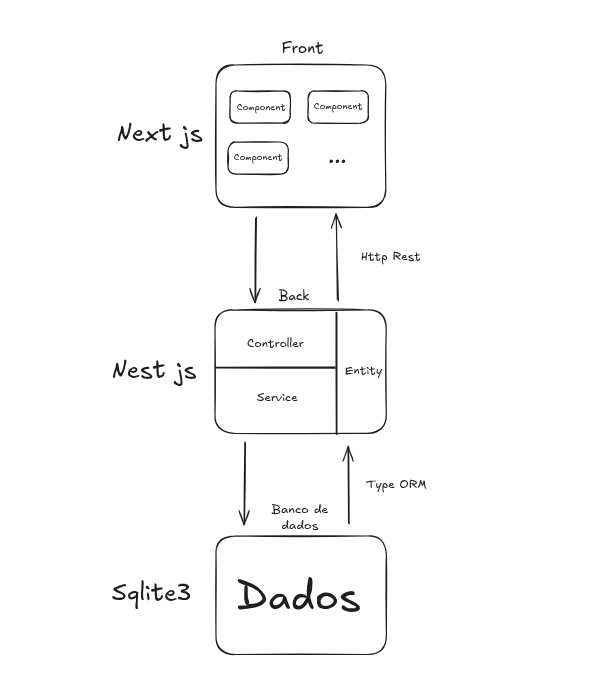
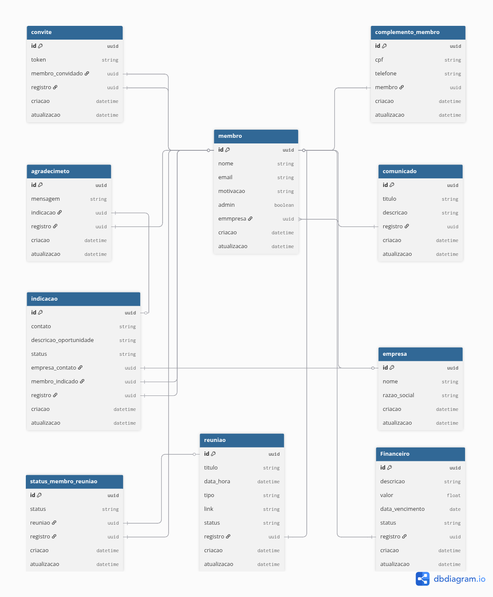
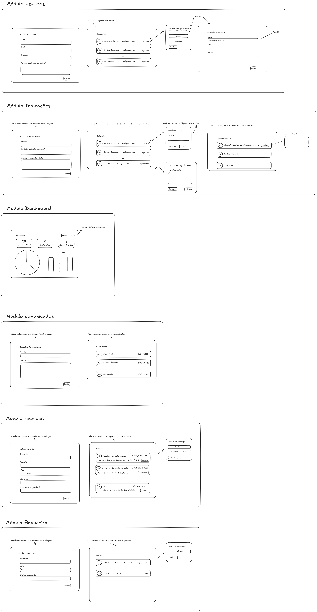

# Arquitetura

### Diagrama de arquitetura

A comunicação base é feito através de um http com front e back, e do back com o banco de dados através do TypeORM.

### Modelo de dados

O módulo inteiro é basicamento construído em torno da entidade membros, logo, o membro na base de dados faz a funçao de user.  
A escolha de salvar membro em todas as tabelas com a descrição de registro é proposital para gerar com clareza o histórico de criação das tabelas. Essa modelagem também facilita a filtragem de perfil para nível de permissão.

### Estrutura de Componentes (Frontend)

components/headers 
components/footer 
components/sidebar 
components/button 
... 
app/dashboard/page 
app/membros/page 
app/membro/[id]/page 
app/intencao/page 
app/reuniao/page 
... 
E todos os outros componentes baseado no croqui acima seguiriam o mesmo padrão. 

Para uma melhor visualização dos desenho das telas é possível abrir no <a href='https://excalidraw.com/'>Excalidraw</a> o arquivo croqui.excalidraw localizado no ./prototipagem/croqui.excalidraw

### Definição da api

 
POST/membro 
GET/membro 
GET/membro/:id 
PATCH/membro/:id 
DELETE/membro/:id 
Todas outras entidades seguiriam o mesmo padrão

